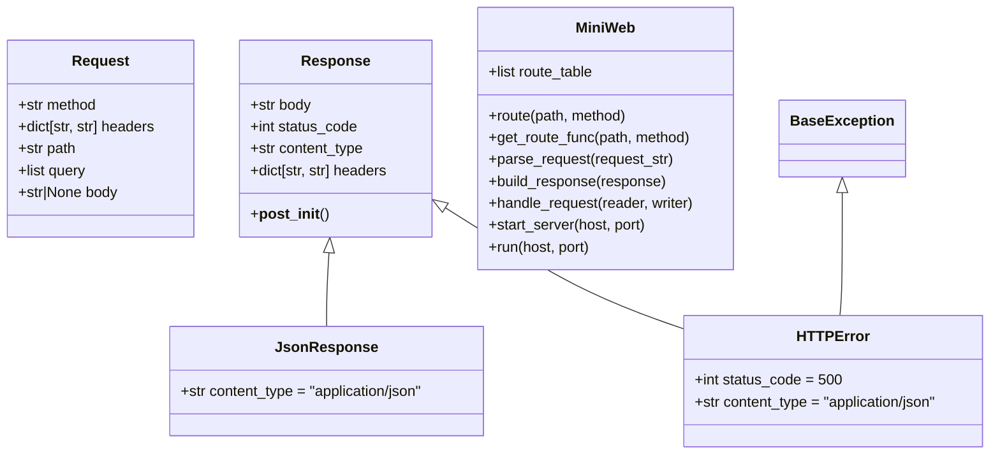
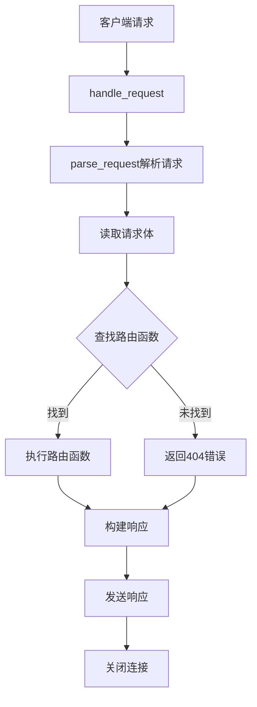
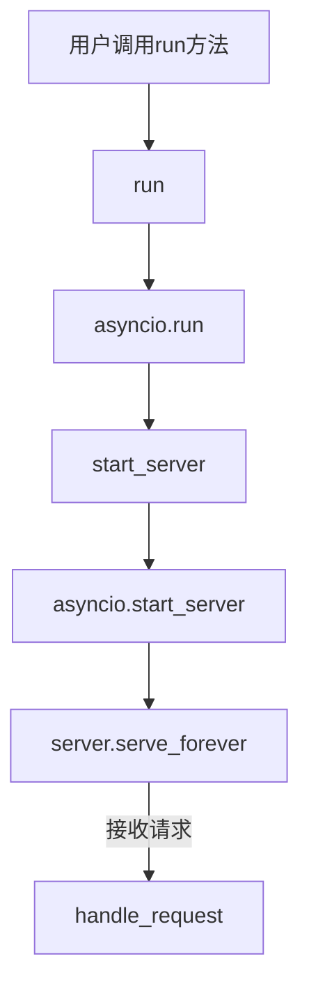
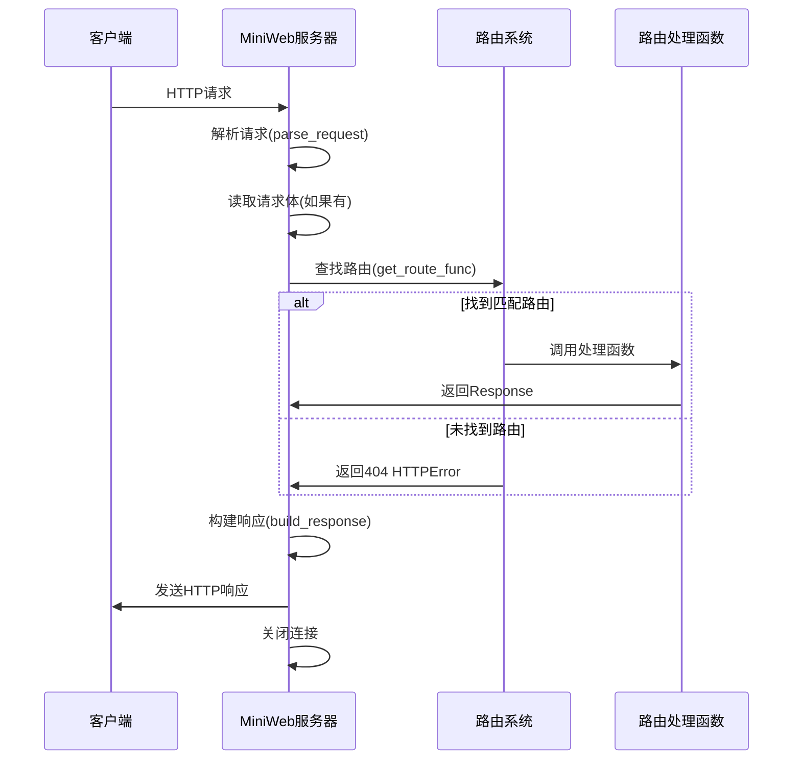

# MINI Web Framework

> 学习一个简单的 Web 框架，使用 Python 编写。该框架支持路由、请求和响应处理。

## 功能

- 仅支持 WEB 核心功能
- 类型提示


## 框架设计图

### 类图



### 请求处理流程图



### 服务器启动流程



### 请求-响应序列图



## 示例

```bash
uv run examples/basic_example.py
```


## 学习

- https://github.com/kadircancetin/MostMinimalWebFramework/tree/main
